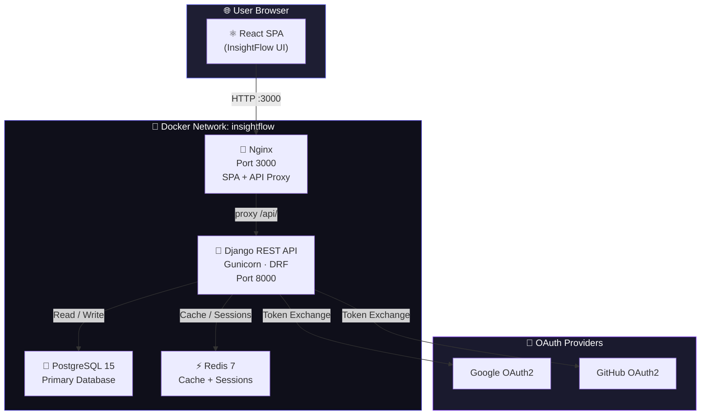
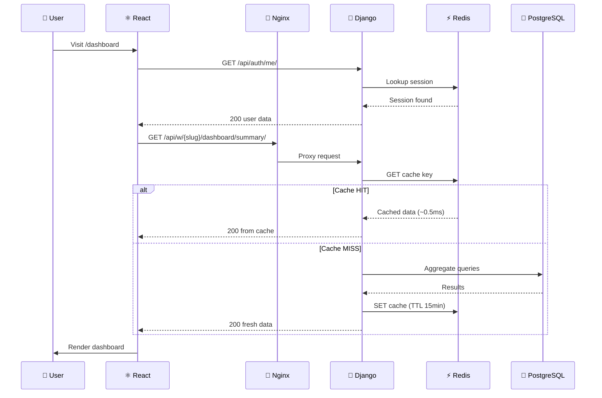
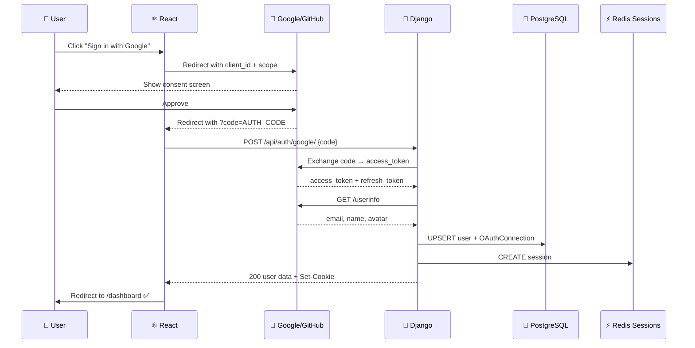
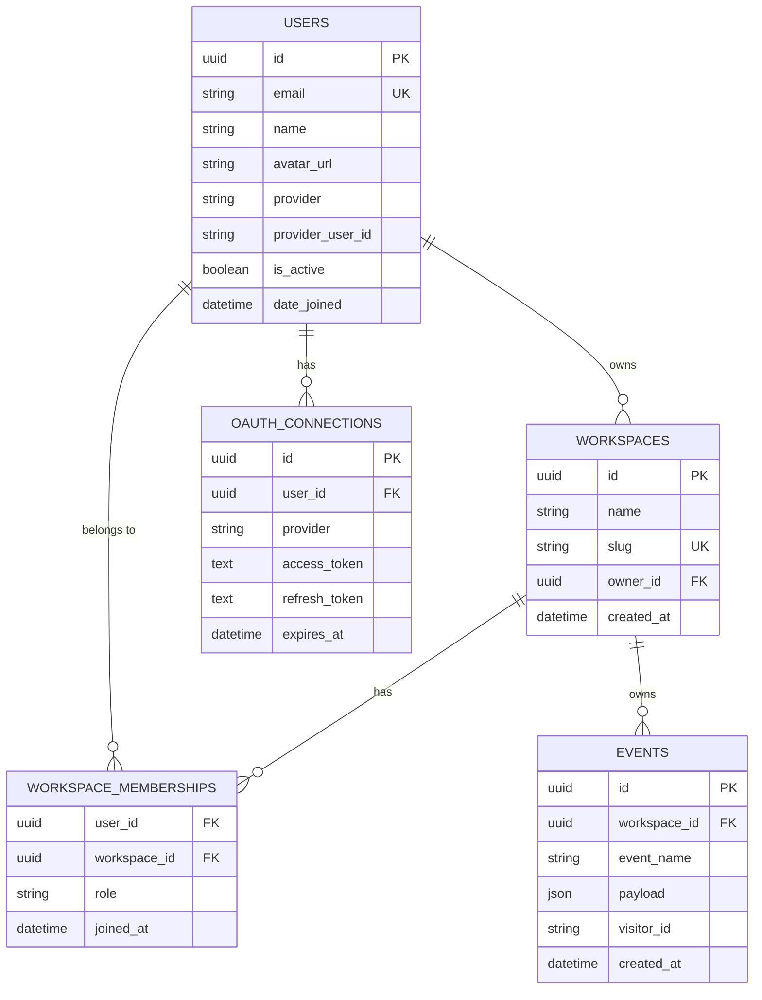
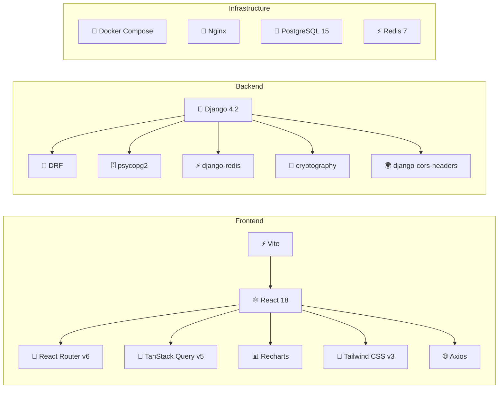
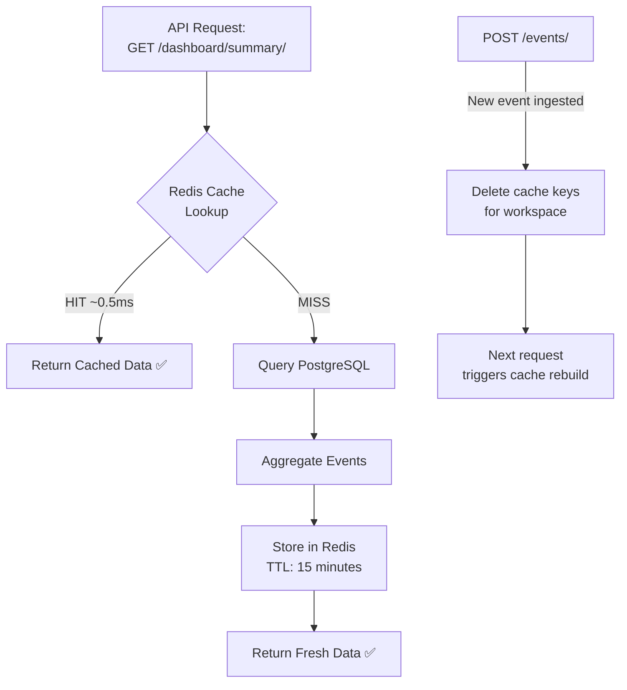
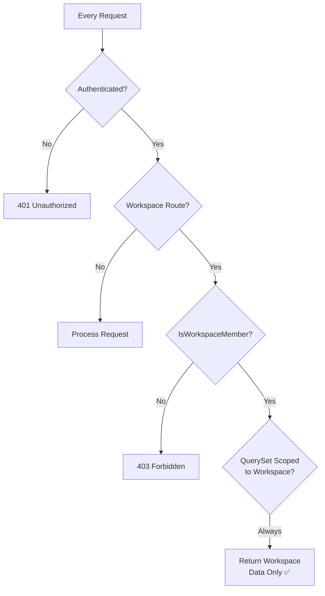

<div align="center">

# 🚀 InsightFlow

### Multi-Tenant SaaS Analytics Platform

[](https://djangoproject.com/)
[](https://reactjs.org/)
[](https://postgresql.org/)
[](https://redis.io/)
[](https://docker.com/)
[](LICENSE)

**Track events. Understand users. Grow faster.**
*A production-ready, multi-tenant analytics platform built with modern full-stack architecture.*

[🎯 Features](#-features) • [🏗️ Architecture](#️-architecture) • [⚡ Quick Start](#-quick-start) • [📡 API Reference](#-api-reference) • [📁 Project Structure](#-project-structure)

---

</div>

## 📖 Overview

**InsightFlow** is a production-style, multi-tenant Software-as-a-Service (SaaS) analytics platform. It enables organisations to create isolated workspaces, ingest analytics events, and visualise dashboards with time-series charts and KPI metrics — all secured behind OAuth2 authentication and strict tenant-level data isolation.

> 💡 **Multi-tenancy** means one application instance serves many organisations simultaneously. Each organisation's data is completely isolated from others — even though they share the same database and infrastructure.

### 🎯 What Makes InsightFlow Different

| Capability | Description |
|---|---|
| 🏢 **Multi-Tenancy** | Workspace-scoped data isolation with role-based access |
| 🔐 **OAuth2** | Sign in with Google or GitHub — no passwords to manage |
| ⚡ **Redis Caching** | Sub-millisecond dashboard responses with intelligent cache invalidation |
| 📊 **Real Analytics** | Time-series charts, KPI cards, top pages, event breakdowns |
| 🐳 **One-Command Deploy** | `docker-compose up --build` starts the entire stack |

---

## ✨ Features

```
┌─────────────────────────────────────────────────────────────────┐
│                       INSIGHTFLOW FEATURES                      │
├──────────────────────┬──────────────────────┬───────────────────┤
│  🔐 Authentication   │  🏢 Multi-Tenancy    │  📊 Analytics     │
│  ─────────────────   │  ───────────────     │  ─────────────    │
│  • Google OAuth2     │  • Workspace CRUD    │  • Event ingestion│
│  • GitHub OAuth2     │  • Role-based access │  • KPI dashboard  │
│  • Session + Redis   │  • Data isolation    │  • Time-series    │
│  • CSRF protection   │  • Tenant switching  │  • Top pages      │
│  • Dev mode login    │  • Member management │  • Event types    │
├──────────────────────┼──────────────────────┼───────────────────┤
│  ⚡ Performance      │  🎨 Frontend         │  🐳 DevOps        │
│  ─────────────────   │  ─────────────────   │  ─────────────    │
│  • Redis cache 15min │  • Dark mode SPA     │  • Docker Compose │
│  • DB index strategy │  • Tailwind CSS      │  • Multi-stage    │
│  • Query optimized   │  • Recharts graphs   │  • Auto-migrate   │
│  • Cache invalidation│  • Glassmorphism     │  • Seed data      │
└──────────────────────┴──────────────────────┴───────────────────┘
```

---

## 🏗️ Architecture

### System Overview



### Request Flow



### OAuth2 Authentication Flow



---

## 🗄️ Database Schema



---

## ⚡ Quick Start

### Prerequisites

| Requirement | Version |
|---|---|
| Docker Desktop | Latest |
| Git | Any |

### 1️⃣ Clone the Repository

```bash
git clone https://github.com/ramalokeshreddyp/InsightFlow.git
cd InsightFlow
```

### 2️⃣ Launch with Docker Compose

```bash
docker-compose up --build
```

> ⏱️ First build takes ~3–5 minutes. Subsequent starts are instant.

**What happens automatically:**
```
✅ PostgreSQL 15 starts with health check
✅ Redis 7 starts with health check
✅ Django migrations run automatically
✅ 300 seed events are created across 2 demo workspaces
✅ Nginx serves the React SPA on port 3000
```

### 3️⃣ Access the Application

| Service | URL |
|---|---|
| 🎨 **Frontend** | http://localhost:3000 |
| 🔌 **API** | http://localhost:3000/api/ |
| 🔧 **Django Admin** | http://localhost:3000/admin/ |

### 4️⃣ Login

Click **⚡ Quick Demo Login (Dev Mode)** on the login page — instant access with pre-seeded data, no OAuth credentials needed.

---

## 🔧 Local Development Setup (Without Docker)

### Backend

```bash
# Create virtual environment
cd backend
python -m venv venv

# Activate (Windows)
venv\Scripts\activate
# Activate (Mac/Linux)
source venv/bin/activate

# Install dependencies
pip install -r requirements.txt

# Configure environment
cp .env.example .env
# Edit .env with your local PostgreSQL and Redis settings

# Run migrations
python manage.py migrate

# Seed demo data
python manage.py seed_data

# Start Django server
python manage.py runserver
```

### Frontend

```bash
cd frontend
npm install
cp .env.example .env
npm run dev
# → http://localhost:3000
```

### Environment Variables

**`backend/.env`** — copy from `.env.example`:

```env
SECRET_KEY=your-django-secret-key
DEBUG=True
ALLOWED_HOSTS=localhost,127.0.0.1

# PostgreSQL
DB_NAME=insightflow
DB_USER=postgres
DB_PASSWORD=postgres
DB_HOST=localhost
DB_PORT=5432

# Redis
REDIS_URL=redis://localhost:6379/0

# OAuth (optional — dev login works without these)
GOOGLE_CLIENT_ID=
GOOGLE_CLIENT_SECRET=
GITHUB_CLIENT_ID=
GITHUB_CLIENT_SECRET=

# Token encryption key
# Generate: python -c "from cryptography.fernet import Fernet; print(Fernet.generate_key().decode())"
TOKEN_ENCRYPTION_KEY=
```

---

## 📡 API Reference

### Authentication Endpoints

| Method | Endpoint | Auth | Description |
|---|---|---|---|
| `GET` | `/api/auth/csrf/` | ❌ | Fetch CSRF token |
| `POST` | `/api/auth/google/` | ❌ | Google OAuth2 login |
| `POST` | `/api/auth/github/` | ❌ | GitHub OAuth2 login |
| `POST` | `/api/auth/dev-login/` | ❌ | Dev mode instant login |
| `GET` | `/api/auth/me/` | ✅ | Get current user |
| `POST` | `/api/auth/logout/` | ✅ | Logout + clear session |

### Workspace Endpoints

| Method | Endpoint | Auth | Description |
|---|---|---|---|
| `GET` | `/api/workspaces/` | ✅ | List user's workspaces |
| `POST` | `/api/workspaces/` | ✅ | Create workspace |
| `GET` | `/api/w/{slug}/` | ✅ Member | Workspace detail |
| `GET` | `/api/w/{slug}/members/` | ✅ Member | List members |

### Analytics Endpoints

| Method | Endpoint | Auth | Description |
|---|---|---|---|
| `POST` | `/api/w/{slug}/events/` | ✅ Member | Ingest event |
| `GET` | `/api/w/{slug}/dashboard/summary/` | ✅ Member | KPI summary *(Redis cached)* |
| `GET` | `/api/w/{slug}/dashboard/timeseries/?period=7d` | ✅ Member | Daily counts |

#### Example: Ingest an Event

```bash
curl -X POST http://localhost:3000/api/w/insightflow-demo/events/ \
  -H "Content-Type: application/json" \
  -H "X-CSRFToken: <token>" \
  --cookie "sessionid=<session>" \
  -d '{
    "event": "page_view",
    "payload": {"page": "/pricing", "referrer": "google"},
    "visitor_id": "visitor-001"
  }'
```

#### Example: Get Dashboard Summary

```bash
curl http://localhost:3000/api/w/insightflow-demo/dashboard/summary/ \
  --cookie "sessionid=<session>"
```

```json
{
  "total_events": 500,
  "unique_visitors": 42,
  "page_views": 312,
  "custom_events": 188,
  "events_last_7d": 78,
  "top_pages": [
    {"page": "/home", "count": 95},
    {"page": "/pricing", "count": 72}
  ],
  "top_events": [
    {"event": "page_view", "count": 312}
  ],
  "member_count": 1
}
```

---

## 📁 Project Structure

```
InsightFlow/
│
├── 📄 docker-compose.yml          # Orchestrates all 4 services
├── 📄 README.md                   # This file
├── 📄 architecture.md             # System architecture docs
├── 📄 projectdocumentation.md     # Full project documentation
│
├── 🐍 backend/
│   ├── 📄 Dockerfile              # Python 3.11 slim + Gunicorn
│   ├── 📄 entrypoint.sh           # Wait → Migrate → Seed → Start
│   ├── 📄 manage.py
│   ├── 📄 requirements.txt
│   ├── 📄 .env.example
│   │
│   ├── insightflow/               # Django project package
│   │   ├── settings.py            # DB, Redis, DRF, CORS, OAuth config
│   │   ├── urls.py                # Root URL routing
│   │   └── wsgi.py
│   │
│   └── core/                      # Main application
│       ├── models.py              # User, Workspace, Event, etc.
│       ├── serializers.py         # DRF serializers
│       ├── permissions.py         # IsWorkspaceMember, IsWorkspaceAdmin
│       ├── urls.py                # 13 API endpoint routes
│       ├── utils.py               # Custom exception handler
│       ├── admin.py               # Django admin registration
│       ├── views/
│       │   ├── auth_views.py      # Google + GitHub OAuth, me, logout
│       │   ├── workspace_views.py # List, create, detail, members
│       │   ├── analytics_views.py # Events, summary (cached), timeseries
│       │   └── dev_views.py       # Dev-only login
│       └── management/
│           └── commands/
│               └── seed_data.py   # Demo data seeder
│
└── ⚛️ frontend/
    ├── 📄 Dockerfile              # Node build → Nginx serve (multi-stage)
    ├── 📄 nginx.conf              # SPA routing + /api/ proxy
    ├── 📄 package.json
    ├── 📄 vite.config.js
    ├── 📄 tailwind.config.js
    ├── 📄 index.html
    └── src/
        ├── App.jsx                # Router + providers
        ├── main.jsx               # React entry point
        ├── index.css              # Tailwind + custom styles
        │
        ├── api/
        │   ├── client.js          # Axios + CSRF interceptors
        │   └── index.js           # auth/workspaces/analytics API fns
        │
        ├── components/
        │   ├── ProtectedRoute.jsx # Auth guard for private routes
        │   ├── Sidebar.jsx        # Nav sidebar with workspace selector
        │   ├── TopBar.jsx         # Sticky header + user menu
        │   └── LoadingScreen.jsx  # Animated loading state
        │
        ├── features/
        │   ├── auth/
        │   │   ├── AuthContext.jsx    # Global auth state
        │   │   └── OAuthCallback.jsx  # Handles OAuth redirect
        │   ├── dashboard/
        │   │   ├── SummaryCards.jsx   # KPI metric cards
        │   │   ├── TimeSeriesChart.jsx # Area chart (Recharts)
        │   │   ├── TopPagesTable.jsx   # Pages with progress bars
        │   │   └── TopEventsChart.jsx  # Event breakdown bar chart
        │   └── workspaces/
        │       ├── WorkspaceContext.jsx  # Active tenant state
        │       ├── WorkspaceSelector.jsx # Dropdown switcher
        │       └── EmptyWorkspace.jsx    # Empty state + create form
        │
        └── pages/
            ├── LoginPage.jsx      # OAuth buttons + dev login
            ├── DashboardPage.jsx  # Main analytics view
            └── WorkspacesPage.jsx # Workspace management
```

---

## 🧰 Tech Stack



### Why This Stack?

| Technology | Why Chosen |
|---|---|
| **Django + DRF** | Rapid API development, strong ORM, built-in admin, robust security defaults |
| **React + Vite** | Fast HMR, component-based UI, huge ecosystem |
| **TanStack Query** | Declarative server state, automatic caching, background refetch |
| **PostgreSQL** | JSONB support for event payloads, advanced indexing, ACID compliance |
| **Redis** | In-memory speed for session storage and analytics caching |
| **Tailwind CSS** | Utility-first, no stylesheet conflicts, rapid custom design |
| **Docker Compose** | Reproducible environment, one-command startup, service orchestration |

---

## ⚡ Caching Strategy



**Cache Keys:**
```
insightflow:workspaces:{workspace_id}:dashboard_summary
insightflow:workspaces:{workspace_id}:dashboard_timeseries_7d
insightflow:workspaces:{workspace_id}:dashboard_timeseries_30d
insightflow:workspaces:{workspace_id}:dashboard_timeseries_90d
```

---

## 🔒 Security



| Security Feature | Implementation |
|---|---|
| **OAuth tokens** | Encrypted with `cryptography.fernet` before DB storage |
| **Sessions** | Stored in Redis (not DB), HTTP-only cookie |
| **CSRF protection** | Django CSRF middleware + `X-CSRFToken` header |
| **Tenant isolation** | `IsWorkspaceMember` on every workspace-scoped endpoint |
| **QuerySet scoping** | All DB queries filtered by `workspace=` before execution |

---

## 🧪 Testing

### Manual Testing Checklist

```bash
# 1. Test protected route redirect
curl http://localhost:3000/dashboard
# → Should redirect to /login

# 2. Test dev login
curl -X POST http://localhost:3000/api/auth/dev-login/ -c cookies.txt
# → 200 with user data

# 3. Test me endpoint
curl http://localhost:3000/api/auth/me/ -b cookies.txt
# → 200 with user info

# 4. List workspaces
curl http://localhost:3000/api/workspaces/ -b cookies.txt
# → 200 with array of workspaces

# 5. Test tenant isolation (wrong workspace slug)
curl http://localhost:3000/api/w/non-existent/dashboard/summary/ -b cookies.txt
# → 403 Forbidden

# 6. Ingest event
curl -X POST http://localhost:3000/api/w/insightflow-demo/events/ \
  -b cookies.txt -H "Content-Type: application/json" \
  -H "X-CSRFToken: $(cat csrftoken.txt)" \
  -d '{"event":"page_view","payload":{"page":"/test"}}'
# → 201 Created

# 7. Dashboard summary (check Redis caching)
time curl http://localhost:3000/api/w/insightflow-demo/dashboard/summary/ -b cookies.txt
# Second call should be significantly faster (cache hit)

# 8. Test logout
curl -X POST http://localhost:3000/api/auth/logout/ -b cookies.txt
curl http://localhost:3000/api/auth/me/ -b cookies.txt
# → 401 Unauthorized
```

---

## 🚀 Deployment Notes

> **Docker Compose** is the recommended way to run InsightFlow. For production:

1. Set `DEBUG=False` in `backend/.env`
2. Generate a strong `SECRET_KEY`
3. Set `ALLOWED_HOSTS` to your domain
4. Configure real OAuth credentials
5. Generate a `TOKEN_ENCRYPTION_KEY` with Fernet

```bash
# Generate SECRET_KEY
python -c "from django.core.management.utils import get_random_secret_key; print(get_random_secret_key())"

# Generate TOKEN_ENCRYPTION_KEY
python -c "from cryptography.fernet import Fernet; print(Fernet.generate_key().decode())"
```

---

## 📄 License

MIT License — see [LICENSE](LICENSE) for details.

---

<div align="center">

**Built with ❤️ using Django · React · PostgreSQL · Redis**

*InsightFlow — Multi-Tenant Analytics for Modern Teams*

</div>
