# InsightFlow — System Architecture

> Comprehensive technical architecture documentation for the InsightFlow multi-tenant SaaS analytics platform.

---

## Table of Contents

1. [Architecture Overview](#1-architecture-overview)
2. [High-Level System Diagram](#2-high-level-system-diagram)
3. [Service Architecture](#3-service-architecture)
4. [Backend Architecture (Django)](#4-backend-architecture-django)
5. [Frontend Architecture (React)](#5-frontend-architecture-react)
6. [Database Architecture](#6-database-architecture)
7. [Caching Architecture (Redis)](#7-caching-architecture-redis)
8. [Authentication Architecture](#8-authentication-architecture)
9. [Multi-Tenancy Architecture](#9-multi-tenancy-architecture)
10. [Network and Infrastructure](#10-network-and-infrastructure)
11. [Data Flow Diagrams](#11-data-flow-diagrams)
12. [Security Architecture](#12-security-architecture)

---

## 1. Architecture Overview

InsightFlow follows a **three-tier web application architecture** with a clear separation between presentation, business logic, and data layers.

```
┌─────────────────────────────────────────────────────────────────────┐
│                        ARCHITECTURE TIERS                           │
├──────────────────────┬──────────────────────┬───────────────────────┤
│  PRESENTATION TIER   │   BUSINESS LOGIC     │      DATA TIER        │
│  ─────────────────   │   ─────────────────  │   ─────────────────   │
│  React 18 SPA        │   Django 4.2         │   PostgreSQL 15       │
│  Tailwind CSS        │   DRF REST API       │   Redis 7             │
│  Recharts            │   Session Auth       │   (Persistent Vol.)   │
│  TanStack Query      │   OAuth2 Exchange    │                       │
│  React Router v6     │   Redis Caching      │                       │
│  Axios HTTP Client   │   Multi-Tenancy      │                       │
└──────────────────────┴──────────────────────┴───────────────────────┘
```

### Architectural Principles

| Principle | Application in InsightFlow |
|---|---|
| **Separation of Concerns** | Frontend, backend, and database are fully decoupled services |
| **Tenant Isolation** | Every DB query is scoped to a workspace; permission checks at the view layer |
| **Cache-Aside Pattern** | Application checks Redis before querying PostgreSQL |
| **Stateless API** | Sessions stored in Redis, not in-memory — horizontally scalable |
| **12-Factor App** | Configuration via environment variables, no secrets in code |

---

## 2. High-Level System Diagram

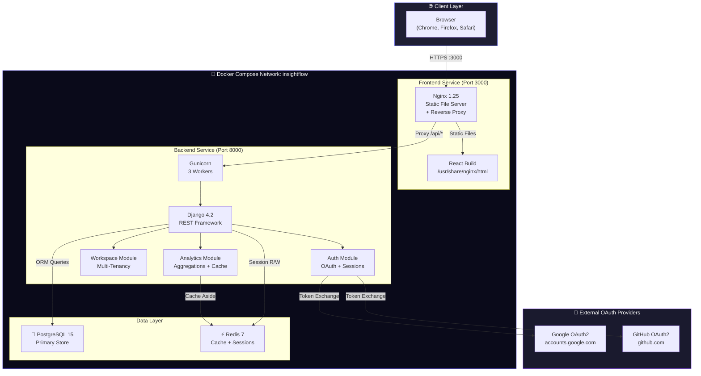

---

## 3. Service Architecture

### Docker Compose Services

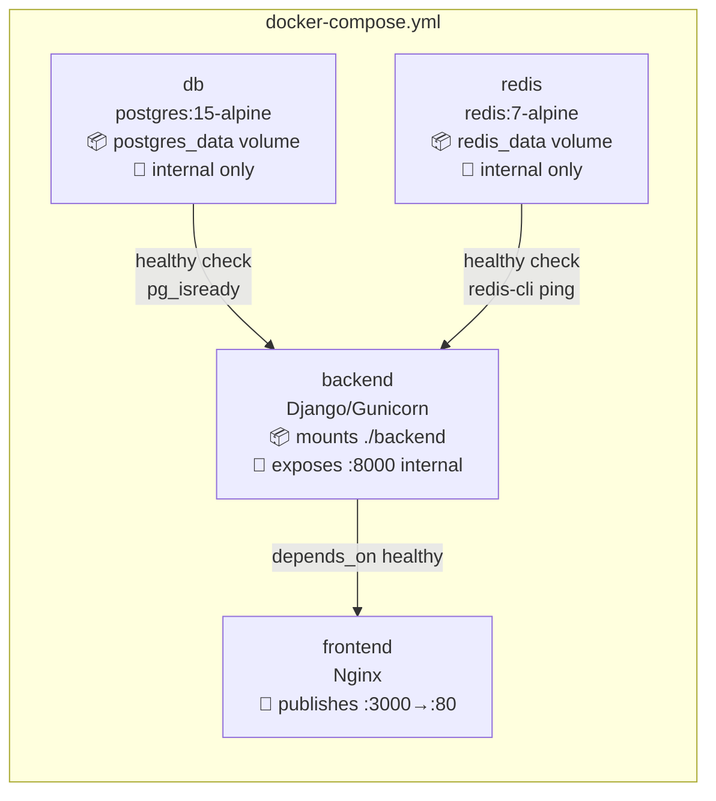

### Container Startup Sequence

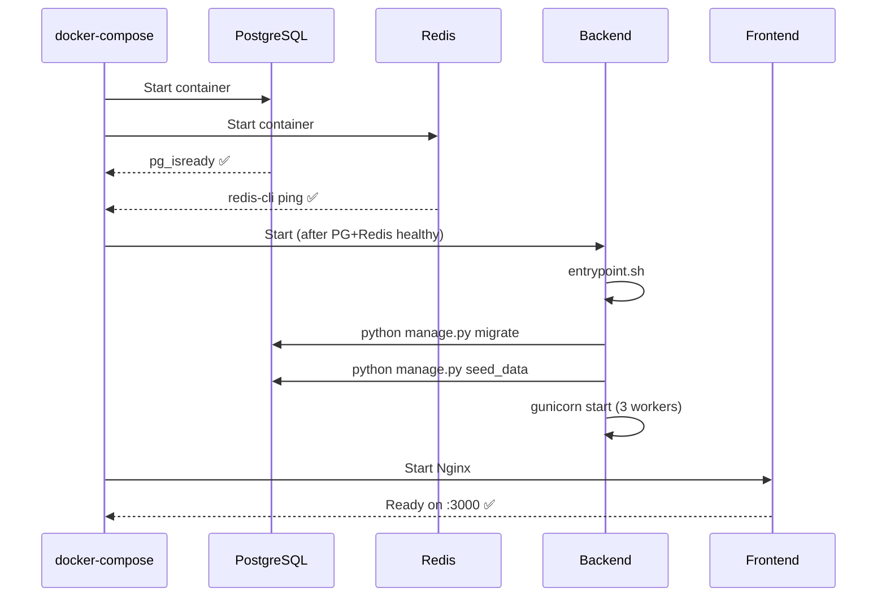

---

## 4. Backend Architecture (Django)

### Module Structure

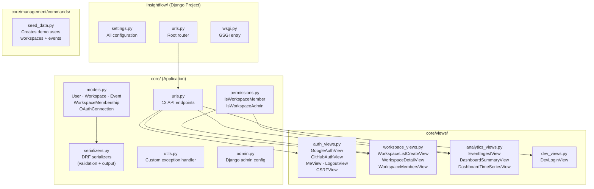

### Request Processing Pipeline

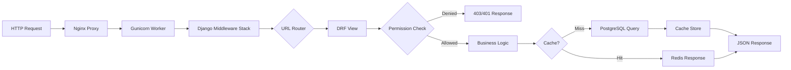

### Django Settings Architecture

```
settings.py
├── DATABASES          → PostgreSQL via psycopg2
├── CACHES             → Redis via django-redis
│   └── KEY_PREFIX     → "insightflow" namespace
├── SESSION_ENGINE     → django.contrib.sessions.backends.cache
├── REST_FRAMEWORK     → SessionAuthentication + custom exception handler
├── CORS               → Frontend origins + allow_credentials
├── AUTH_USER_MODEL    → core.User (custom UUID-based model)
└── OAuth Config       → CLIENT_ID, CLIENT_SECRET, REDIRECT_URI
```

---

## 5. Frontend Architecture (React)

### Component Tree

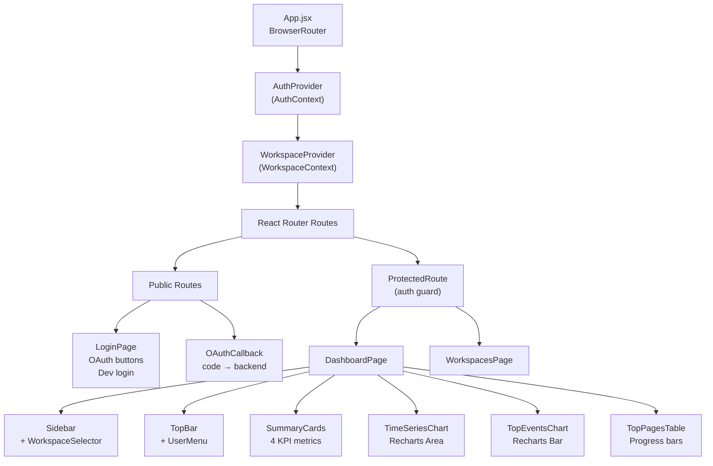

### State Management

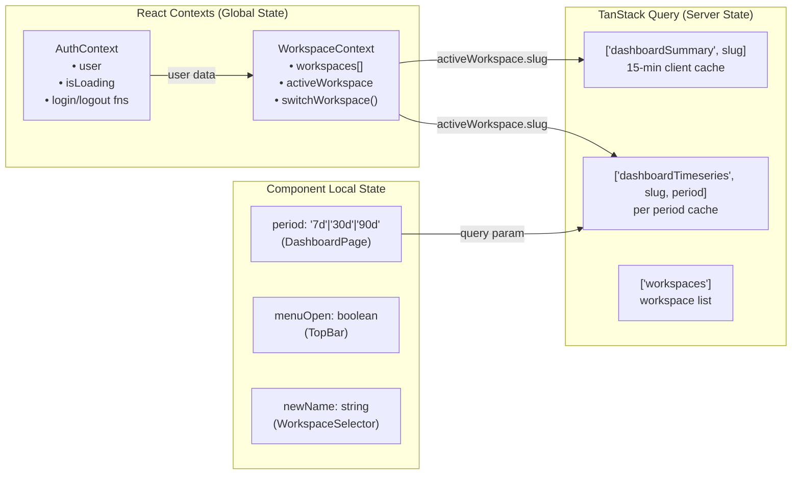

### Data Fetching Flow

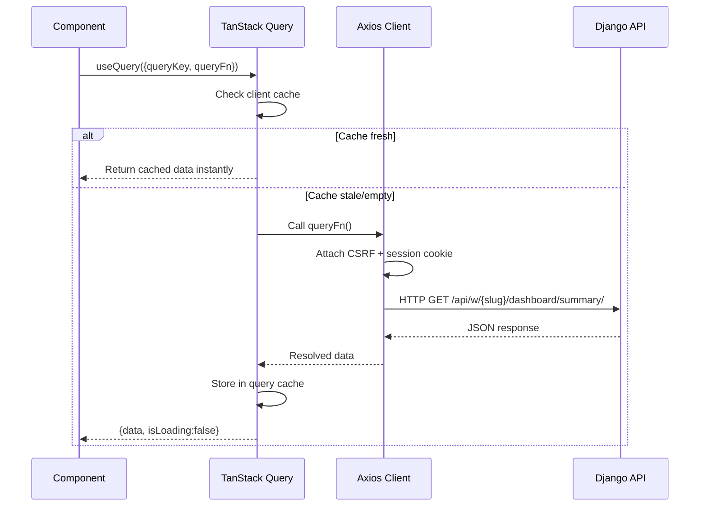

---

## 6. Database Architecture

### Schema Design

```
┌──────────────────────────────────────────────────────────────────┐
│                        POSTGRESQL SCHEMA                         │
├──────────────────────────────────────────────────────────────────┤
│                                                                  │
│  users                          workspaces                       │
│  ─────────────────              ─────────────────────           │
│  id          UUID PK            id         UUID PK              │
│  email       VARCHAR UNIQUE     name       VARCHAR(200)         │
│  name        VARCHAR(255)       slug       SLUG UNIQUE          │
│  avatar_url  URL                owner_id   FK → users           │
│  provider    VARCHAR(20)        created_at TIMESTAMPTZ          │
│  provider_uid VARCHAR(255)      updated_at TIMESTAMPTZ          │
│  is_active   BOOLEAN                                             │
│  date_joined TIMESTAMPTZ        workspace_memberships            │
│                                 ─────────────────────────       │
│  oauth_connections              user_id      FK → users         │
│  ─────────────────              workspace_id FK → workspaces    │
│  id         UUID PK             role         VARCHAR(20)        │
│  user_id    FK → users          joined_at    TIMESTAMPTZ        │
│  provider   VARCHAR(20)         UNIQUE(user_id, workspace_id)   │
│  access_token TEXT (encrypted)                                   │
│  refresh_token TEXT (encrypted) events                          │
│  expires_at TIMESTAMPTZ         ─────────────────────────       │
│                                 id           UUID PK            │
│                                 workspace_id FK → workspaces    │
│                                 event_name   VARCHAR(100)       │
│                                 payload      JSONB              │
│                                 visitor_id   VARCHAR(255)       │
│                                 created_at   TIMESTAMPTZ        │
└──────────────────────────────────────────────────────────────────┘
```

### Index Strategy

```sql
-- Events: primary analytical query path
CREATE INDEX idx_event_workspace_time
    ON events(workspace_id, created_at DESC);

CREATE INDEX idx_event_workspace_name
    ON events(workspace_id, event_name);

-- Users: OAuth lookup on every login
CREATE INDEX idx_user_provider
    ON users(provider, provider_user_id);

-- Memberships: permission check on every workspace request
CREATE INDEX idx_membership_workspace_user
    ON workspace_memberships(workspace_id, user_id);
```

### Query Patterns

| Query | Index Used | Typical Cost |
|---|---|---|
| `Event.filter(workspace=ws).count()` | `idx_event_workspace_time` | O(log n) |
| `Event.filter(workspace=ws, event_name='page_view')` | `idx_event_workspace_name` | O(log n) |
| `Event.filter(workspace=ws, created_at__gte=...)` | `idx_event_workspace_time` | O(log n) range |
| `WorkspaceMembership.filter(user=u, workspace__slug=s)` | `idx_membership_workspace_user` | O(1) |
| `User.get(provider=p, provider_user_id=id)` | `idx_user_provider` | O(1) |

### JSONB Payload Design

Events use a PostgreSQL `JSONB` field for flexible payload storage:

```json
// page_view
{"page": "/pricing", "referrer": "google", "duration_ms": 3200}

// button_click
{"element": "cta-button", "page": "/home", "text": "Get Started"}

// form_submit
{"form": "signup", "source": "landing-page"}
```

JSONB is chosen over plain text because:
- **Indexed queries**: `payload->>'page'` uses GIN indexes
- **Type safety**: Enforces valid JSON at DB level
- **Flexible schema**: Different event types have different fields

---

## 7. Caching Architecture (Redis)

### Cache-Aside Pattern

```mermaid
flowchart TD
    A["GET /dashboard/summary/"] --> B["Build cache key:\nworkspaces:{id}:dashboard_summary"]
    B --> C{{"Redis CACHE.GET(key)"}}

    C -->|"HIT ✅\n~0.5ms"| D["Return cached JSON\nto client"]

    C -->|"MISS ❌\n~50-200ms"| E["Query PostgreSQL:\n• COUNT events\n• DISTINCT visitors\n• TOP pages aggregation\n• TOP event types\n• Last 7d count"]
    E --> F["Build response dict"]
    F --> G{{"Redis CACHE.SET(key, data, TTL=900)"}}}
    G --> H["Return fresh JSON\nto client"]

    I["POST /events/ (new event)"] --> J{{"Redis CACHE.DELETE(\nall workspace cache keys)"}}}
    J --> K["Next request triggers\ncache rebuild"]
```

### Session Storage

```
Redis Key Structure:
─────────────────────────────────────────────
django.sessions:{session_id}   → session JSON
insightflow:workspaces:{id}:dashboard_summary → cached dict
insightflow:workspaces:{id}:dashboard_timeseries_7d → list
insightflow:workspaces:{id}:dashboard_timeseries_30d → list
insightflow:workspaces:{id}:dashboard_timeseries_90d → list
─────────────────────────────────────────────

TTL Policy:
Session keys    → SESSION_COOKIE_AGE (default 86400s = 1 day)
Dashboard cache → 900s (15 minutes)
Timeseries cache → 900s (15 minutes)
```

### Performance Impact

| Scenario | Without Redis | With Redis |
|---|---|---|
| First dashboard load | ~150ms (DB aggregation) | ~150ms (cache miss) |
| Subsequent loads | ~150ms (no cache) | ~1ms (cache hit) |
| Session lookup | ~10ms (DB query) | ~0.5ms (Redis) |
| Concurrent 100 users | Heavy DB load | Single DB query shared |

---

## 8. Authentication Architecture

### Session-Based Authentication Flow

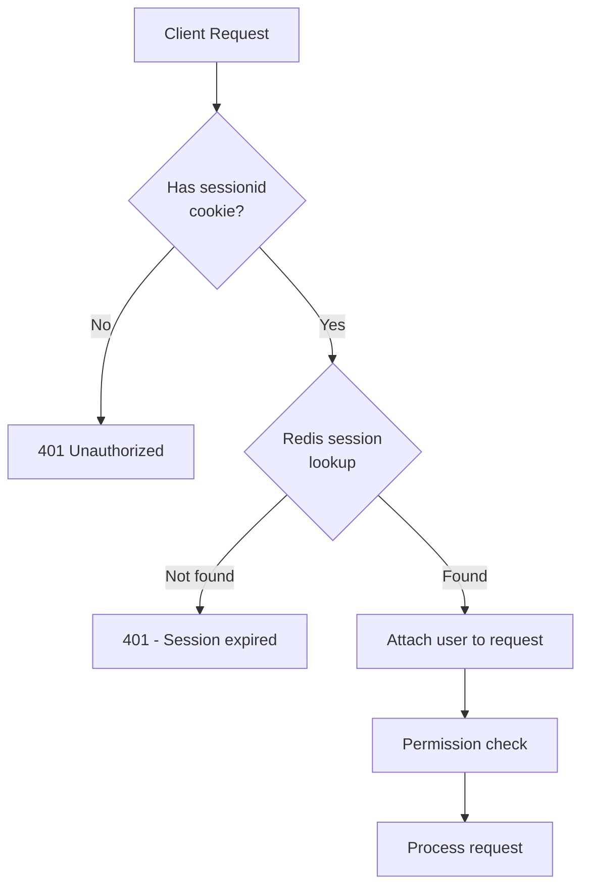

### OAuth Token Storage

```
Token Security Flow:
─────────────────────────────────────────────────
1. OAuth provider returns: access_token + refresh_token
2. application.encrypt_token(access_token)
   └─ Fernet.encrypt(token.encode())
   └─ Stores as base64-encoded ciphertext
3. Stored in oauth_connections.access_token (TEXT)
4. To use: Fernet.decrypt(stored_bytes).decode()
─────────────────────────────────────────────────
Key: TOKEN_ENCRYPTION_KEY (Fernet 32-byte base64)
Algorithm: AES-128-CBC + HMAC-SHA256
```

### Session vs JWT Decision

InsightFlow deliberately chose **session-based authentication** over JWT because:

| Factor | Session (Chosen) | JWT |
|---|---|---|
| **Revocation** | Instant (delete Redis key) | Requires token blacklist |
| **Complexity** | Simple (Django built-in) | Custom middleware needed |
| **Storage** | Redis (fast, centralised) | Client-side (stateless) |
| **Security** | HTTP-only cookie, no XSS | localStorage vulnerable |
| **Use case** | Web SPA (our case) | Mobile / microservices |

---

## 9. Multi-Tenancy Architecture

### Tenant Isolation Model

InsightFlow uses **shared database, shared schema** multi-tenancy — the most common SaaS pattern.

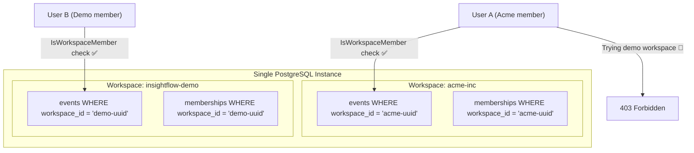

### Isolation Enforcement Layers

```
Layer 1 — URL Design:
  /api/w/{workspace_slug}/...
  Workspace slug is always explicit in the URL.

Layer 2 — Permission Class:
  class IsWorkspaceMember(BasePermission):
      def has_permission(self, request, view):
          return WorkspaceMembership.objects.filter(
              user=request.user,
              workspace__slug=view.kwargs['workspace_slug']
          ).exists()
  Applied to: ALL workspace-scoped views

Layer 3 — QuerySet Scoping:
  Event.objects.filter(workspace=workspace, ...)
  No view ever queries events without workspace filter.

Layer 4 — Cache Key Isolation:
  workspaces:{workspace_id}:... keys are tenant-specific
```

### Role Permission Matrix

| Action | Admin | Editor | Viewer |
|---|---|---|---|
| View dashboard | ✅ | ✅ | ✅ |
| Ingest events | ✅ | ✅ | ❌ |
| View members | ✅ | ✅ | ✅ |
| Manage members | ✅ | ❌ | ❌ |
| Delete workspace | ✅ | ❌ | ❌ |

---

## 10. Network and Infrastructure

### Docker Network Topology

```
Host Machine
│
├── Port 3000 (exposed) ──────────────────────────────┐
│                                                      │
│  ┌──── Docker Network: insightflow ────────────────┐ │
│  │                                                  │ │
│  │  ┌─────────────┐   proxy /api/   ┌───────────┐  │ │
│  │  │   frontend   │ ──────────────► │  backend  │  │ │
│  │  │  Nginx :80   │                │ Gunicorn  │  │ │
│  │  └─────────────┘                 │ Django    │  │ │
│  │         ▲                        └─────┬─────┘  │ │
│  │         │                             │         │ │
│  │         │                     ┌───────┴───────┐  │ │
│  │         │                     │               │  │ │
│  │         │               ┌─────▼────┐   ┌──────▼─┐│ │
│  │         │               │    db    │   │ redis  ││ │
│  │         │               │ PG 15    │   │ v7     ││ │
│  │         │               └──────────┘   └────────┘│ │
│  └─────────┼──────────────────────────────────────┘ │ │
│            │                                         │ │
└────────────┼─────────────────────────────────────────┘ │
             │                                            │
             └────────────────────────────────────────────┘
```

### Volume Architecture

```yaml
volumes:
  postgres_data:   # Named volume — survives container restarts
    driver: local  # Stores: /var/lib/postgresql/data

  redis_data:      # Named volume — persists Redis AOF logs
    driver: local  # Stores: /data (appendonly.aof)

  static_files:    # Django collectstatic output
    driver: local  # Shared between backend and (optional) Nginx
```

---

## 11. Data Flow Diagrams

### Event Ingestion Flow

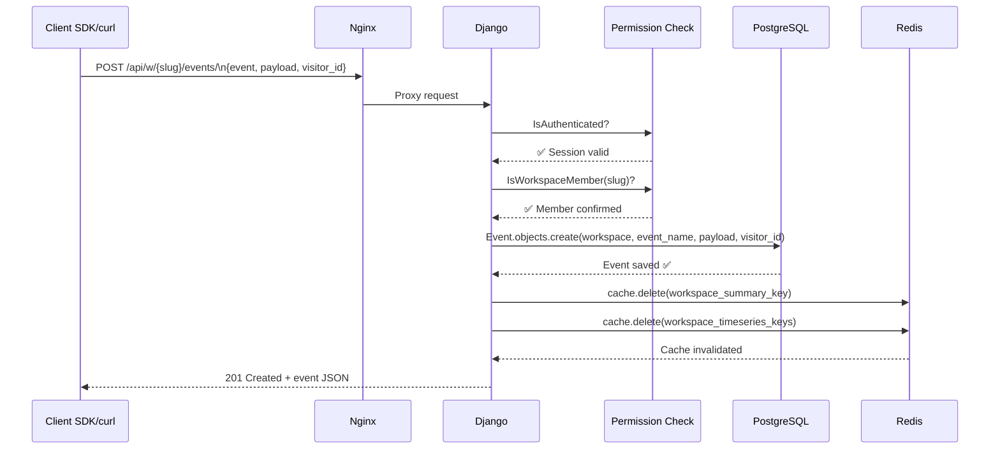

### Dashboard Render Flow

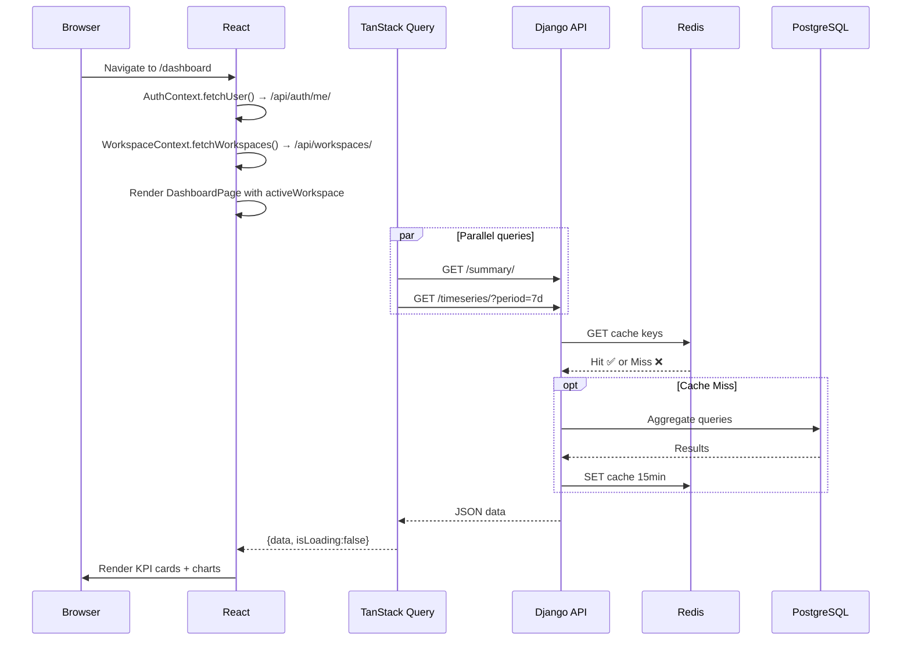

---

## 12. Security Architecture

### Defence in Depth

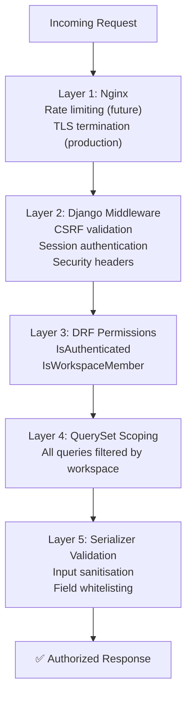

### Threat Model

| Threat | Mitigation |
|---|---|
| **Cross-Tenant Data Leak** | `IsWorkspaceMember` + QuerySet workspace filter on every request |
| **Session Hijacking** | HTTP-only cookie, `SameSite=Lax`, session stored in Redis |
| **CSRF Attack** | Django CSRF middleware + `X-CSRFToken` header required on writes |
| **OAuth Token Theft** | Tokens encrypted at rest with AES-128 (Fernet) |
| **SQL Injection** | Django ORM parameterised queries — no raw SQL |
| **XSS** | React DOM escaping, HTTP-only session cookie |
| **Brute Force** | OAuth offloads credentials to Google/GitHub (rate-limited) |
| **Insecure Secrets** | All secrets via environment variables, `.env` in `.gitignore` |

---

*InsightFlow Architecture — v1.0 | Last updated: May 2026*
