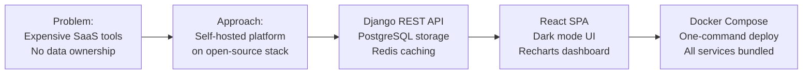
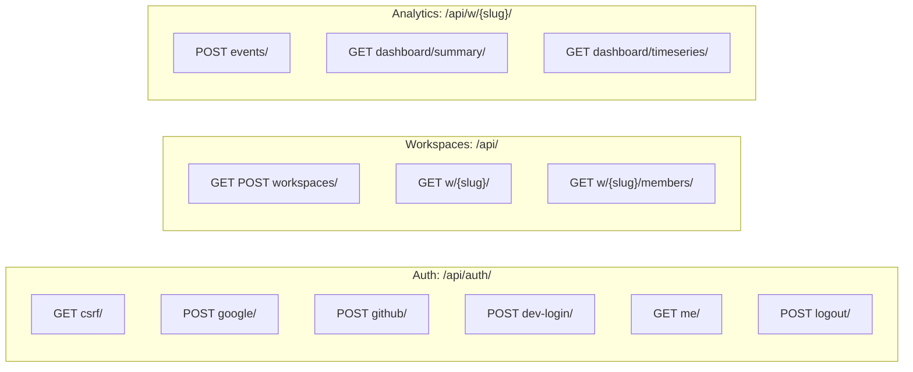
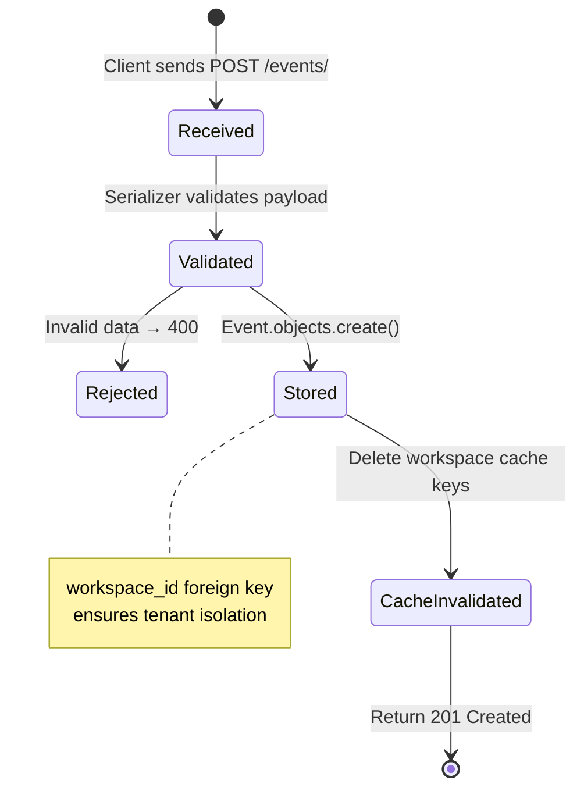
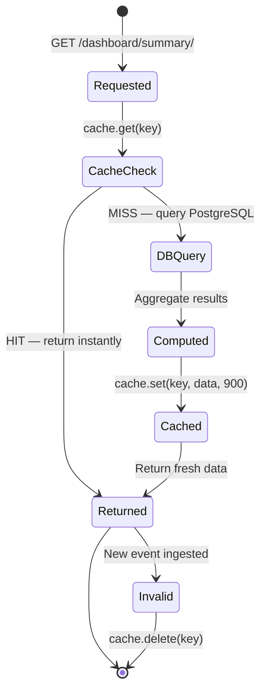

# InsightFlow — Project Documentation

> Complete technical and functional documentation for the InsightFlow multi-tenant SaaS analytics platform.

---

## Table of Contents

1. [Project Overview](#1-project-overview)
2. [Problem Statement](#2-problem-statement)
3. [Solution Approach](#3-solution-approach)
4. [Tech Stack & Justification](#4-tech-stack--justification)
5. [Key Modules](#5-key-modules)
6. [API Endpoints](#6-api-endpoints)
7. [Data Flow](#7-data-flow)
8. [Multi-Tenancy Design](#8-multi-tenancy-design)
9. [Caching Strategy](#9-caching-strategy)
10. [Security Design](#10-security-design)
11. [Pros, Cons & Trade-offs](#11-pros-cons--trade-offs)
12. [Testing Strategy](#12-testing-strategy)
13. [Setup & Deployment](#13-setup--deployment)
14. [Future Roadmap](#14-future-roadmap)

---

## 1. Project Overview

**InsightFlow** is a production-ready, multi-tenant SaaS analytics platform. It allows multiple organisations to independently track user events, measure key metrics, and visualise trends through an interactive dashboard — all while sharing a single application instance with full data isolation.

### Core Objectives

| Objective | Implementation |
|---|---|
| OAuth2 authentication | Google + GitHub via authorization code flow |
| Multi-tenant isolation | Workspace model with role-based membership |
| Analytics ingestion | REST endpoint accepting JSON event payloads |
| Dashboard analytics | Aggregated KPIs + time-series with Redis cache |
| One-command deployment | `docker-compose up --build` |

### Project Scope

```
IN SCOPE                          OUT OF SCOPE
────────────────────              ────────────────────
✅ OAuth2 (Google + GitHub)       ❌ Email/password auth
✅ Workspace management           ❌ Billing / payments
✅ Event ingestion API            ❌ Real-time WebSocket
✅ Dashboard (KPIs + charts)      ❌ Custom alert rules
✅ Redis caching                  ❌ Data export (CSV/PDF)
✅ Multi-tenant isolation         ❌ SSO / SAML
✅ Docker Compose setup           ❌ Kubernetes deployment
```

---

## 2. Problem Statement

Modern analytics tools (Mixpanel, Amplitude, PostHog) are expensive, opaque, and lock data into proprietary formats. Small-to-mid teams need:

1. **Self-hosted analytics** — full data ownership
2. **Tenant isolation** — one deployment for multiple orgs
3. **Fast dashboards** — not waiting 5s for every metric query
4. **OAuth login** — no password management burden

InsightFlow solves all four with an open, Docker-deployable stack.

---

## 3. Solution Approach



### Design Decisions

**1. Shared Schema Multi-Tenancy**
Every table has a `workspace_id` foreign key. All queries are filtered by workspace at the application layer. Simpler than row-level security, easier to migrate, and sufficient for this scale.

**2. Session Auth over JWT**
Sessions stored in Redis provide instant revocation, HTTP-only cookies prevent XSS, and Django's built-in session framework removes complexity. JWT would only be needed for stateless microservices or mobile apps.

**3. Cache-Aside over Write-Through**
Dashboard data is expensive to compute but tolerates 15-minute staleness. Cache-aside (check → miss → query → store) is simpler and avoids over-caching stale writes.

**4. Vite + React over Next.js**
The dashboard is a purely client-rendered SPA. Server-side rendering provides no SEO benefit for authenticated pages. Vite builds are faster and the output is simple static files served by Nginx.

---

## 4. Tech Stack & Justification

### Backend

| Package | Version | Purpose | Why |
|---|---|---|---|
| Django | 4.2 LTS | Web framework | Battle-tested, strong ORM, built-in admin |
| djangorestframework | 3.15 | REST API | DRF serializers + permissions model |
| psycopg2-binary | 2.9 | PostgreSQL driver | Native PG adapter |
| django-redis | 5.4 | Redis cache | `django.core.cache` integration |
| django-cors-headers | 4.3 | CORS | SPA cross-origin requests |
| cryptography | 42.0 | Token encryption | Fernet AES-128 for OAuth tokens |
| django-environ | 0.11 | Env vars | Typed `.env` file parsing |
| gunicorn | 22.0 | WSGI server | Production-grade Python server |
| requests | 2.31 | HTTP client | OAuth token exchange with providers |

### Frontend

| Package | Version | Purpose | Why |
|---|---|---|---|
| React | 18.3 | UI framework | Hooks, context, huge ecosystem |
| react-router-dom | 6.23 | Routing | Declarative routes, `<Outlet>` nesting |
| @tanstack/react-query | 5.40 | Server state | Caching, loading states, refetch |
| axios | 1.7 | HTTP client | Interceptors for CSRF + credentials |
| recharts | 2.12 | Charts | React-native, composable, responsive |
| tailwindcss | 3.4 | Styling | Utility-first, no CSS conflicts |
| date-fns | 3.6 | Date utils | Lightweight date formatting |
| Vite | 5.3 | Build tool | Fast HMR, ESM native |

### Infrastructure

| Tool | Version | Purpose |
|---|---|---|
| PostgreSQL | 15 Alpine | Primary relational DB |
| Redis | 7 Alpine | Cache + session store |
| Nginx | 1.25 Alpine | Static serve + reverse proxy |
| Docker Compose | v3.9 | Service orchestration |

---

## 5. Key Modules

### 5.1 Authentication Module (`core/views/auth_views.py`)

Handles the complete OAuth2 authorization code flow for both Google and GitHub.

```
GoogleAuthView / GitHubAuthView
  │
  ├── Validate: code parameter present
  ├── HTTP POST: Exchange code → access_token (provider API)
  ├── HTTP GET: Fetch user info (email, name, avatar)
  ├── DB: UPSERT user record (get_or_create by email)
  ├── DB: UPSERT OAuthConnection (encrypted tokens)
  ├── Redis: CREATE session
  └── Response: 200 user JSON + Set-Cookie: sessionid
```

**Token Encryption:**
```python
def encrypt_token(token: str) -> str:
    f = Fernet(settings.TOKEN_ENCRYPTION_KEY)
    return f.encrypt(token.encode()).decode()
```

### 5.2 Workspace Module (`core/views/workspace_views.py`)

Manages tenant creation and membership.

```
WorkspaceListCreateView
  GET  → Filter workspaces by user memberships
  POST → Create workspace + auto-add creator as admin

WorkspaceDetailView
  GET  → Return single workspace (membership required)

WorkspaceMembersView
  GET  → List all members with roles
```

### 5.3 Analytics Module (`core/views/analytics_views.py`)

The most performance-critical module.

```
EventIngestView
  POST → Validate payload → Create Event → Invalidate Redis cache

DashboardSummaryView
  GET  → Check Redis cache
       → MISS: Run aggregation queries → Cache result 15min
       → HIT:  Return cached JSON (~0.5ms)

DashboardTimeSeriesView
  GET  → Period param (7d/30d/90d)
       → TruncDate aggregation → Fill missing days with 0
       → Cache per workspace + period
```

**Aggregation query example:**
```python
top_pages = (
    Event.objects
    .filter(workspace=workspace, event_name='page_view')
    .values('payload__page')
    .annotate(view_count=Count('id'))
    .order_by('-view_count')[:10]
)
```

### 5.4 Permission Module (`core/permissions.py`)

```python
class IsWorkspaceMember(BasePermission):
    def has_permission(self, request, view):
        workspace_slug = view.kwargs.get('workspace_slug')
        return WorkspaceMembership.objects.filter(
            user=request.user,
            workspace__slug=workspace_slug,
        ).exists()
```

Applied to every workspace-scoped view as `permission_classes = [IsAuthenticated, IsWorkspaceMember]`.

### 5.5 AuthContext (`frontend/src/features/auth/AuthContext.jsx`)

Global React context holding authentication state:

```
State:  user, isLoading, error
Actions: loginWithGoogle(code), loginWithGitHub(code), logout(), devLogin()
Effect:  fetchUser() on mount → GET /api/auth/me/
```

### 5.6 WorkspaceContext (`frontend/src/features/workspaces/WorkspaceContext.jsx`)

```
State:  workspaces[], activeWorkspace, isLoading
Actions: fetchWorkspaces(), switchWorkspace(ws), createWorkspace(name)
Persist: activeWorkspace slug → sessionStorage
```

---

## 6. API Endpoints

### Full Endpoint Catalogue



### Request / Response Contracts

**POST `/api/auth/google/`**
```json
// Request
{"code": "4/0AX4XfWi..."}

// Response 200
{"id": "uuid", "email": "user@gmail.com", "name": "Jane", "provider": "google"}

// Response 400
{"error": "Failed to exchange authorization code with Google."}
```

**POST `/api/workspaces/`**
```json
// Request
{"name": "Acme Inc."}

// Response 201
{"id": "uuid", "name": "Acme Inc.", "slug": "acme-inc", "owner": {...}, "member_count": 1}
```

**GET `/api/w/{slug}/dashboard/summary/`**
```json
// Response 200
{
  "total_events": 1250,
  "unique_visitors": 87,
  "page_views": 890,
  "custom_events": 360,
  "events_last_7d": 143,
  "top_pages": [{"page": "/home", "count": 240}],
  "top_events": [{"event": "page_view", "count": 890}],
  "member_count": 3,
  "workspace": {"id": "uuid", "name": "Acme Inc.", "slug": "acme-inc"}
}

// Response 403 (not a member)
{"error": "You do not have permission to access this workspace."}
```

---

## 7. Data Flow

### Event Lifecycle



### Cache Lifecycle



---

## 8. Multi-Tenancy Design

### Workspace as Tenant

```
Tenant = Workspace
  └── Has: name, slug (URL identifier), owner
  └── Has many: WorkspaceMembership (users + roles)
  └── Has many: Events (all analytics data)

User ←→ Workspace (many-to-many via WorkspaceMembership)
  └── role: admin | editor | viewer
```

### Isolation Guarantee

Every analytics query follows this pattern — no exceptions:

```python
# ✅ CORRECT — always scoped
workspace = get_object_or_404(Workspace, slug=workspace_slug)
events = Event.objects.filter(workspace=workspace, ...)

# ❌ NEVER happens — would leak cross-tenant data
events = Event.objects.all()
```

The `IsWorkspaceMember` permission class runs **before** any view logic executes, ensuring unauthorised requests never reach the database layer.

---

## 9. Caching Strategy

### What Is Cached

| Endpoint | Cache Key | TTL | Invalidated On |
|---|---|---|---|
| `GET /dashboard/summary/` | `workspaces:{id}:dashboard_summary` | 15 min | New event ingested |
| `GET /dashboard/timeseries/?period=7d` | `workspaces:{id}:dashboard_timeseries_7d` | 15 min | New event ingested |
| `GET /dashboard/timeseries/?period=30d` | `workspaces:{id}:dashboard_timeseries_30d` | 15 min | New event ingested |
| `GET /dashboard/timeseries/?period=90d` | `workspaces:{id}:dashboard_timeseries_90d` | 15 min | New event ingested |

### What Is NOT Cached

- Auth endpoints (always fresh)
- Workspace list (changes infrequently, small payload)
- Member list (security-sensitive)

### Redis Configuration

```python
CACHES = {
    'default': {
        'BACKEND': 'django_redis.cache.RedisCache',
        'LOCATION': 'redis://redis:6379/0',
        'OPTIONS': {
            'CLIENT_CLASS': 'django_redis.client.DefaultClient',
            'COMPRESSOR': 'django_redis.compressor.zlib.ZlibCompressor',
        },
        'KEY_PREFIX': 'insightflow',
    }
}
```

The `zlib` compressor reduces Redis memory usage by ~40–60% for JSON payloads.

---

## 10. Security Design

### CSRF Protection

```
1. Browser loads app → GET /api/auth/csrf/
2. Django sets csrftoken cookie
3. Axios interceptor reads cookie → adds X-CSRFToken header
4. Django validates token on every POST/PUT/DELETE
```

### Input Validation

All inputs pass through DRF serializers before any processing:

```python
class EventIngestSerializer(serializers.Serializer):
    event = serializers.CharField(max_length=100)
    payload = serializers.DictField(required=False, default=dict)
    visitor_id = serializers.CharField(max_length=255, required=False)
```

Unknown fields are rejected. The `payload` is stored as JSONB — no SQL injection risk via Django ORM parameterised queries.

### Sensitive Data Handling

| Data | Storage | Protection |
|---|---|---|
| OAuth access tokens | PostgreSQL `oauth_connections` | Fernet encrypted |
| OAuth refresh tokens | PostgreSQL `oauth_connections` | Fernet encrypted |
| Session IDs | Redis `django.sessions:*` | HTTP-only cookie |
| User passwords | Never stored | OAuth-only login |
| Secrets / API keys | Environment variables | Never in source code |

---

## 11. Pros, Cons & Trade-offs

### Pros

| Area | Benefit |
|---|---|
| **Deployment** | Single `docker-compose up` runs the entire platform |
| **Data ownership** | Self-hosted — no third-party data sharing |
| **Performance** | Redis caching reduces repeated DB aggregations to ~0.5ms |
| **Security** | OAuth offloads credential management; tokens encrypted at rest |
| **Extensibility** | Clear module boundaries; adding new event types requires no schema changes (JSONB) |
| **Developer UX** | Dev login bypasses OAuth for instant local testing |
| **Multi-tenancy** | Workspace isolation prevents data leaks between tenants |

### Cons / Limitations

| Area | Limitation |
|---|---|
| **Scale** | Shared schema multi-tenancy can hit PostgreSQL limits at millions of events per tenant |
| **Real-time** | Dashboard requires manual refresh; no WebSocket push |
| **Caching granularity** | 15-min TTL means dashboard lags behind real ingestion by up to 15 min |
| **OAuth only** | No email/password fallback for users without Google or GitHub accounts |
| **Single region** | No built-in geographic distribution or read replicas |

### Trade-off Decisions

| Decision | Chosen | Alternative | Reason |
|---|---|---|---|
| Auth | Session + Redis | JWT | Simpler revocation, safer for web SPA |
| Multi-tenancy | Shared schema | Separate schemas | Lower ops overhead; sufficient isolation for this scale |
| Cache invalidation | Delete on write | Short TTL only | Ensures dashboard freshness after event ingestion |
| Frontend | CSR (Vite) | SSR (Next.js) | All pages are authenticated; SSR adds no value |

---

## 12. Testing Strategy

### Unit Tests (Django)

```python
# Test workspace isolation
def test_cannot_access_other_workspace(self):
    other_ws = Workspace.objects.create(name="Other", slug="other", owner=other_user)
    response = self.client.get(f'/api/w/{other_ws.slug}/dashboard/summary/')
    self.assertEqual(response.status_code, 403)

# Test cache miss + hit
def test_dashboard_summary_caches_on_second_request(self):
    # First call — cache miss
    r1 = self.client.get(f'/api/w/{self.ws.slug}/dashboard/summary/')
    self.assertEqual(r1.status_code, 200)

    # Second call — should hit cache (response identical)
    r2 = self.client.get(f'/api/w/{self.ws.slug}/dashboard/summary/')
    self.assertEqual(r1.json(), r2.json())
```

### API Integration Test Checklist

```bash
# Auth
✅ POST /api/auth/dev-login/   → 200 + user JSON
✅ GET  /api/auth/me/          → 200 + user JSON (authenticated)
✅ GET  /api/auth/me/          → 401 (unauthenticated)
✅ POST /api/auth/logout/      → 200
✅ GET  /api/auth/me/          → 401 (after logout)

# Workspaces
✅ GET  /api/workspaces/       → 200 + array
✅ POST /api/workspaces/       → 201 + workspace object
✅ GET  /api/w/{slug}/         → 200 (member)
✅ GET  /api/w/{slug}/         → 403 (non-member)

# Analytics
✅ POST /api/w/{slug}/events/  → 201 (member)
✅ POST /api/w/{slug}/events/  → 403 (non-member)
✅ GET  /api/w/{slug}/dashboard/summary/      → 200
✅ GET  /api/w/{slug}/dashboard/timeseries/   → 200 (array of {date, count})
✅ GET  /api/w/{slug}/dashboard/timeseries/?period=30d → 30 data points
```

### Frontend Testing Checklist

```
✅ /dashboard redirects to /login when unauthenticated
✅ Dev login → redirects to /dashboard
✅ Workspace selector shows all user workspaces
✅ Creating workspace → appears in sidebar dropdown
✅ Switching workspace → dashboard data updates
✅ Period selector 7d/30d/90d → chart updates
✅ Logout → session cleared → /login
```

---

## 13. Setup & Deployment

### Docker Compose (Recommended)

```bash
# Clone
git clone https://github.com/ramalokeshreddyp/InsightFlow.git
cd InsightFlow

# Start all services (DB + Redis + Backend + Frontend)
docker-compose up --build

# App available at: http://localhost:3000
```

**What `docker-compose up --build` does automatically:**

```
1. Build backend image (Python 3.11 + requirements)
2. Build frontend image (Node 20 build → Nginx serve)
3. Start PostgreSQL with health check
4. Start Redis with health check
5. Start backend → entrypoint.sh:
   a. Wait for PG + Redis to be healthy
   b. python manage.py migrate
   c. python manage.py seed_data --events 300
   d. gunicorn start (3 workers)
6. Start Nginx frontend (proxies /api/ → backend:8000)
```

### Environment Variables Reference

**`backend/.env`** (copy from `.env.example`):

```env
SECRET_KEY=                    # Django secret key (required)
DEBUG=True                     # Set False in production
ALLOWED_HOSTS=localhost        # Comma-separated hostnames

DB_NAME=insightflow            # PostgreSQL database name
DB_USER=postgres               # PostgreSQL username
DB_PASSWORD=postgres           # PostgreSQL password
DB_HOST=db                     # Service name in docker-compose
DB_PORT=5432

REDIS_URL=redis://redis:6379/0 # Redis connection string

GOOGLE_CLIENT_ID=              # From Google Cloud Console
GOOGLE_CLIENT_SECRET=
GOOGLE_REDIRECT_URI=http://localhost:3000/auth/callback/google

GITHUB_CLIENT_ID=              # From GitHub Developer Settings
GITHUB_CLIENT_SECRET=
GITHUB_REDIRECT_URI=http://localhost:3000/auth/callback/github

TOKEN_ENCRYPTION_KEY=          # Fernet key for token encryption
CORS_ALLOWED_ORIGINS=http://localhost:3000
```

**Generate keys:**
```bash
# SECRET_KEY
python -c "from django.core.management.utils import get_random_secret_key; print(get_random_secret_key())"

# TOKEN_ENCRYPTION_KEY
python -c "from cryptography.fernet import Fernet; print(Fernet.generate_key().decode())"
```

### OAuth App Setup (Optional)

**Google:**
1. Go to https://console.cloud.google.com/apis/credentials
2. Create OAuth 2.0 Client ID → Web application
3. Authorized redirect URI: `http://localhost:3000/auth/callback/google`
4. Copy Client ID and Secret → `backend/.env`

**GitHub:**
1. Go to https://github.com/settings/developers → OAuth Apps → New
2. Authorization callback URL: `http://localhost:3000/auth/callback/github`
3. Copy Client ID and Secret → `backend/.env`

### Production Checklist

```
☐ Set DEBUG=False
☐ Generate strong SECRET_KEY
☐ Generate TOKEN_ENCRYPTION_KEY
☐ Set ALLOWED_HOSTS to your domain
☐ Configure HTTPS (TLS termination via Nginx or load balancer)
☐ Set SESSION_COOKIE_SECURE=True
☐ Add real OAuth credentials
☐ Configure PostgreSQL with strong password
☐ Set up automated backups for postgres_data volume
☐ Configure log aggregation
```

---

## 14. Future Roadmap

### Phase 2 — Enhanced Analytics

```
☐ Funnel analysis (event A → event B conversion rates)
☐ Retention cohorts
☐ User journey tracking (visitor_id session stitching)
☐ Custom dashboards with drag-and-drop widgets
☐ Date range picker (custom from/to)
```

### Phase 3 — Platform Features

```
☐ Email/password authentication (as fallback)
☐ Workspace invite system (email invitations)
☐ API key generation (for server-side event ingestion)
☐ Event schema validation (define allowed event types)
☐ Data export (CSV, JSON)
☐ Webhook support (trigger on event threshold)
```

### Phase 4 — Scale & Operations

```
☐ PostgreSQL read replicas (separate analytics queries)
☐ Time-series partitioning (events table by month)
☐ Celery + Redis Queue (async aggregation jobs)
☐ Kubernetes Helm chart
☐ OpenTelemetry tracing
☐ Grafana + Prometheus monitoring
```

---

## Appendix: Core File Reference

| File | Lines | Purpose |
|---|---|---|
| `backend/core/models.py` | ~150 | All 5 Django models with indexes |
| `backend/core/views/auth_views.py` | ~170 | Google + GitHub OAuth + session management |
| `backend/core/views/analytics_views.py` | ~130 | Event ingestion + Redis-cached dashboard |
| `backend/core/permissions.py` | ~35 | `IsWorkspaceMember` tenant guard |
| `backend/insightflow/settings.py` | ~110 | PostgreSQL, Redis, DRF, CORS, OAuth config |
| `frontend/src/features/auth/AuthContext.jsx` | ~80 | Global auth state + OAuth login actions |
| `frontend/src/features/dashboard/TimeSeriesChart.jsx` | ~90 | Recharts area chart with custom tooltip |
| `frontend/src/api/client.js` | ~40 | Axios instance with CSRF interceptor |
| `frontend/src/index.css` | ~130 | Tailwind + custom dark-mode design system |
| `docker-compose.yml` | ~60 | All 4 service definitions with health checks |

---

*InsightFlow Project Documentation — v1.0 | May 2026*
